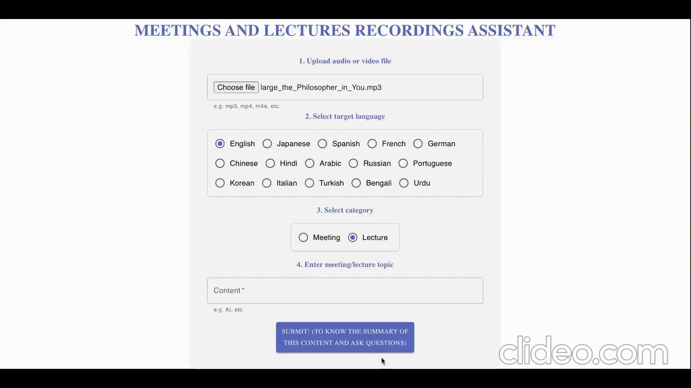

# AI-powered-Multilingual-Meetings-Lectures-Assistant
**AI-powered-Multilingual-Meetings-Lectures-Assistant is a web app that automatically generates transcripts and summaries of meetings or lectures and answer your questions also regarding the recordings as a chatbot.**

<h1 align="center">
  
</h1>


##hosted at 
https://meetings-and-lectures-recordings-as.vercel.app/

## Overview

Key features:

- frontend is implemented in react.js framwork.
- **Transcribe almost any audio/video file with high accuracy using Whisper model ** 
- **Summarize transcripts** using [OpenAI LLMs](https://openai.com/blog/openai-api/)
- **Easy-to-use web interface**
- Support for **English, Japanese, English, Japanese, Spanish, French, German, Chinese, Hindi,Arabic,Russian,Portuguese, Korean, Italian,Turkish, Bengali and Urdu**
- Compatible with both **CPU and GPU**
- Implemented in Docker for instant, hassle-free deployment and portability on any machine.
- can handle multiple parallel requests using load balancing.

## Installation

#### 1. Place the environment variables in the `.env` file

You need to place the following environment variables.

- `OPENAI_API_KEY` is the API key for summarization, which can be found [here](https://platform.openai.com/account/api-keys).

- `REACT_APP_PUBLIC_IP` is the public IP address of the machine that runs the app.
  - If you deploy the app on your local machine, should be `'0.0.0.0'`.
  - If you deploy the app on a remote server, should be the public IP address of the server.

You can place the environment variables in the `.env` file by running the following commands:

```bash
cd minutes-maker
echo "OPENAI_API_KEY='sk-XXX'" >> .env
echo "REACT_APP_PUBLIC_IP='XXX.XXX.XXX.XXX'" >> .env
```

#### 2. Build the Docker image

Whether the machine has a NVIDIA GPU or not is automatically detected and the appropriate Docker image is built.

```bash
make build
```

#### 3. Run the app

```bash
make up
```

#### 4. Access the app

Open `http://<PUBLIC_IP or 0.0.0.0>:10356` in your browser.

## Usage

_Just fill the form and click the **Submit** button!_

**Here is a brief explanation of the form:**

1. **Upload audio/video file**

    Select an audio/video file to be transcribed and summarized. Almost any audio/video file can be used, and the file size is not limited.

2. **Select target language**

    Select the target language to be summarized. **Note that the language of the audio/video file is automatically detected and cannot be changed**, so you should select _what language you want to summarize_.

    Currently, English, Japanese, Spanish, French, German, Chinese, Hindi,Arabic,Russian,Portuguese, Korean, Italian,Turkish, Bengali, Urdu   are supported.

3. **Select category**

    Select the category of the audio/video file, **meeting** or **lecture**. Appropriate setting of this parameter will improve the quality of the summary.

4. **Enter meeting/lecture topic**

    Enter the topic of the meeting/lecture, such as the theme of it (e.g. "development of the new product").
    Set appropriate topic to improve the quality of the transcript.

## Requirements
- Docker

## License

This repository is licensed under CC BY-NC-SA 4.0. See [LICENSE](./LICENSE) for more information.
